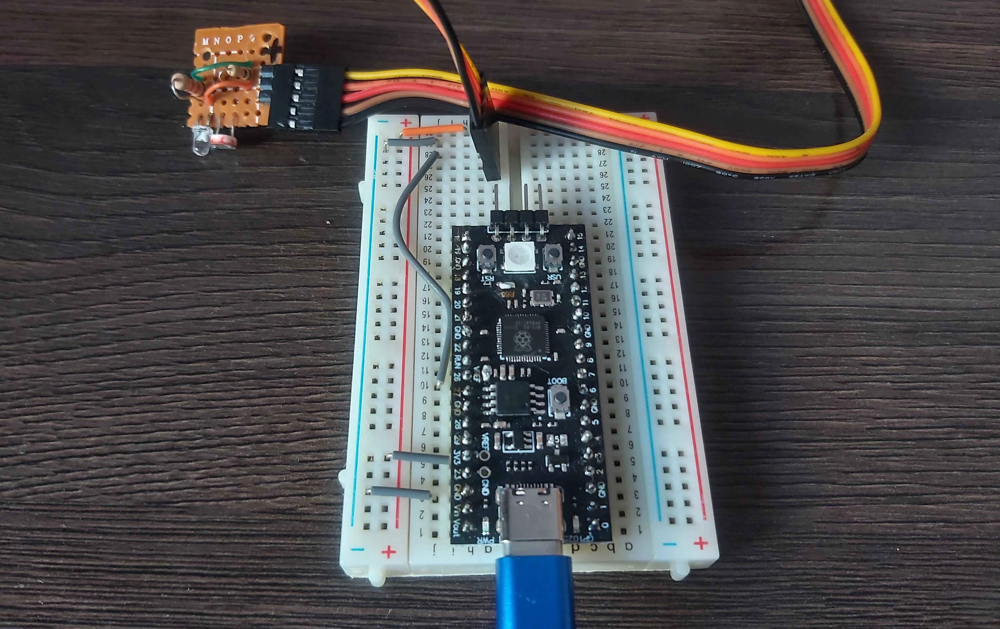
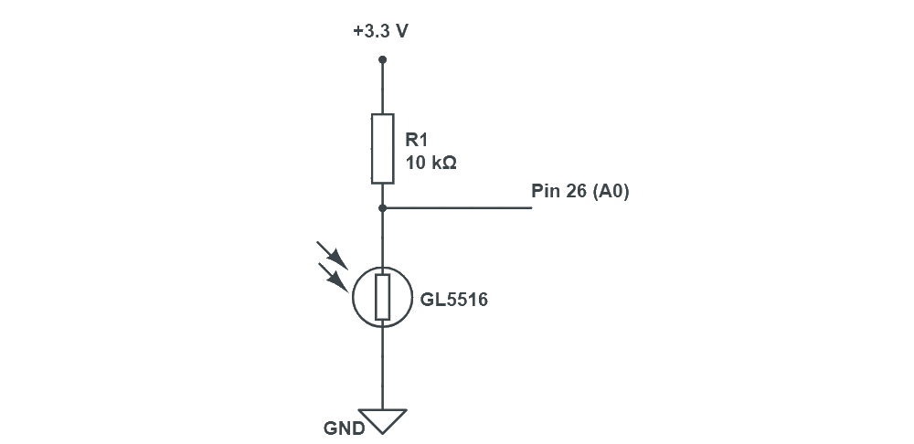
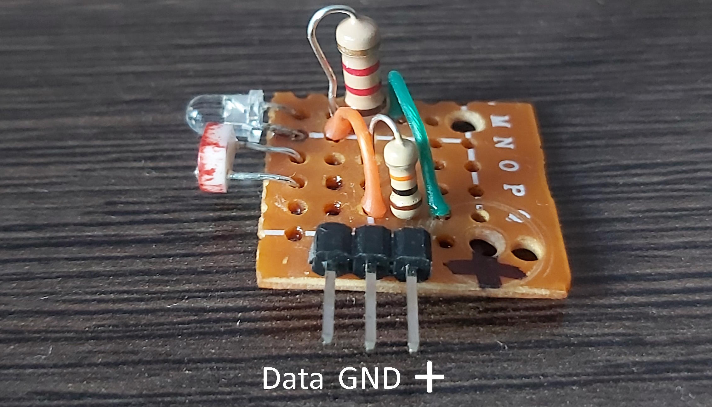
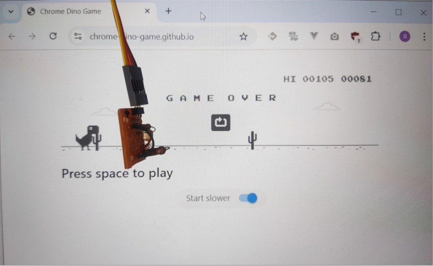

# RPi Pico Dino hardware bot

This code makes RPi Pico play [Dino](https://chrome-dino-game.github.io/) game from Chrome browser by reading screen with light sensor and sending key codes to PC.  

## Demo
  

https://youtu.be/3Do6O7bi3xY    
https://vkvideo.ru/video-228936534_456239022  

## Hardware



- RPi Pico or other compatible board with [RP2040](https://www.raspberrypi.com/products/rp2040/) chip. ([YD-RP2040](https://github.com/initdc/YD-RP2040/blob/master/YD-2040-PIN.png) board was used for this project)  
- Analog light sensor, connect to pin 26 (A0)  
- Button, connect to pin 24  
- (optional) Led, connect to pin 25   
- (optional )NeoPixel led, connect to pin 23  

### [YD-RP2040](https://github.com/initdc/YD-RP2040/blob/master/YD-2040-PIN.png) board

This board contains build-in button, led and NeoPixel led. You need to solder `VREF` and `RGB` jumpers on the board to make ADC and NeoPixel led work.   
[YD-RP2040 Pinout](https://github.com/IvoryRubble/dino_hardware_bot/blob/master/media/YD-RP2040.png)

### DIY light sensor

Light sensor uses resistor and photoresistor assembled to voltage divider.  
Components used:  
- Resistor: 20 kOhm  
- Photoresistor: GL5516 ([Datasheet](https://github.com/IvoryRubble/dino_hardware_bot/blob/master/media/GL55%20Series%20Photoresistor%20datasheet.pdf)) 

Scheme:  


Photos:  
(Led is not used in this project)  


## Installation

- Install CircuitPython to RPi Pico 
- Copy content of [CIRCUITPY ](https://github.com/IvoryRubble/dino_hardware_bot/tree/master/CIRCUITPY) folder to RPi Pico
- (Optional) Restore CircuitPy packages if something missing:   
  `circup install adafruit_hid neopixel`    

## Usage

    
Launch [Dino](https://chrome-dino-game.github.io/) game in browser.   
Place light sensor on the screen in approx. 3 cm to the right of dino on the white background.  
Connect RPi Pico board to PC and open serial port.     
After startup NeoPixel led lights green. After 3 seconds calibration begins. NeoPixel flashes green during calibration.   Launch Dino game manually during calibration for light sensor to see black obstacles moves behind it. Make sure that at least one black obstackle moves behind light sensor during calibration.     
After 10 seconds calibration finishes and you will get message with calibration results in serial port:      
```
Min:  9282 Max:  11986 Mid:  10634.0
Control loop begin...
```
You can also press built-in button to immediately finish calibration.    
After calibration control loop starts. RPi Pico plays Dino game automatically at this point by detecting obstacles with light sensor and pressing Space button when it detects obstacles on the screen. If Dino jumps too early or to late then adjust light sensor position by moving it to the left or to the right.        
To stop control loop press built-in button again.    
To restart calibration press built-in button again.   

